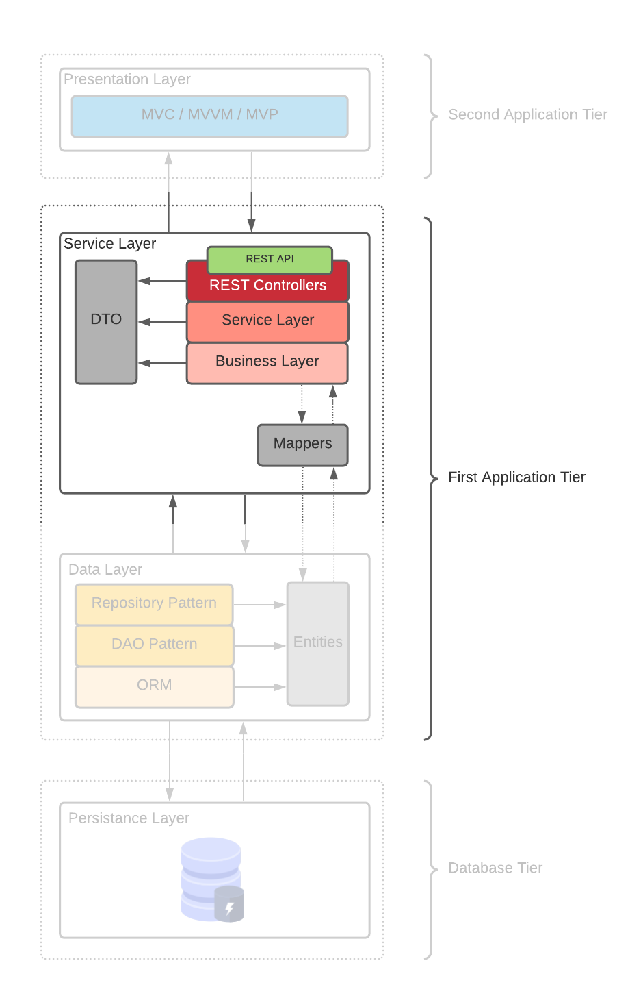

# Service / Business Layer

## Overview

[GitHub - una-eif509-desarrolloweb-master/taskapp-layer-business-service: A basic example of a service layer using Spring Boot](https://github.com/una-eif509-desarrolloweb-master/taskapp-layer-business-service)

[Task App] Example of Business / Service Layer

The Service Layer is usually constructed in discrete operations that have to be supported for a client. It provides the implementation for the application's business logic, including such things as business rules, validations, and calculation logic.

The Business Layer is at the same level as the Service Layer.

The service layer allows us to isolate the presentation layer from the business layer, in the same way the business and data access layer separates the persist data.

## Data Transfer Objects (DTO’s)

- Is an object that carries data between processes.
- The majority of the cost of each call is related to the round-trip time between the client and the server, one way of reducing the number of calls is to use an object (the DTO) that aggregates the data that would have been transferred by the several calls.
- DTO does not have any behavior except for storage, retrieval, serialization and deserialization of its own data.
- DTOs are simple objects that should not contain any business logic but may contain serialization and deserialization mechanisms for transferring data over the wire. Model Mapper

### Mappers frameworks [ DTO → ← MODEL ]

[MapStruct - Java bean mappings, the easy way!](https://mapstruct.org/)

[ModelMapper - Simple, Intelligent, Object Mapping.](http://modelmapper.org/)

## Business Layer

The Business Layer is the place where all the business/domain logic, i.e. rules that are particular to the problem that the application has been built to handle, lives. This might be salary calculations, data analysis modelling, or workflow such as passing a order through different stages.

## Testing

- Our Service layer code is dependent on our DAO/Repository.
- To test the Service layer, we do not need to know or care about how the persistence layer is implemented.
- We should be able to write and test our Service layer code without wiring in our full persistence layer.
- Using mockito to help in the testing process.

### Mockito

- Open-source mocking framework for Java.

- Is a mocking framework for unit tests in Java.

- It has been designed to be intuitive to use when the test needs mock.

- More information:

  https://www.notion.so/mikeguzman/Service-Business-Layer-81215c6f41654cd1a00e79dda9533753#578300ef63ba4a748bfe6d08dc5e25a4